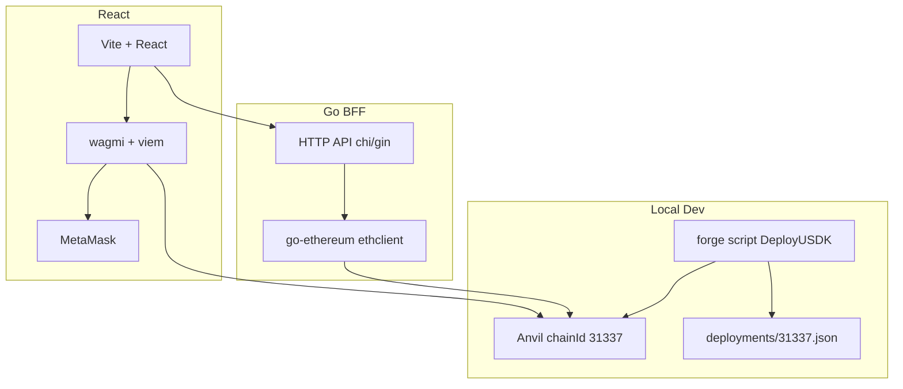

# USDK 可视化界面（Go BFF + React）

## 架构



**职责划分**

| 层 | 技术 | 职责 |
|----|------|------|
| 链 | Anvil + [DeployUSDK.s.sol](script/DeployUSDK.s.sol) | 部署 USDK / Engine / Mock ERC20 / Mock Oracle |
| Go BFF | `go-ethereum` + `chi` | 只读：配置、仓位、HF、清算预览、价格 |
| React | `wagmi` + `viem` + MetaMask | 写操作签名：`approve`、`deposit`、`redeem`、`mint`、`burn`、`liquidate` |

---

## 目录结构（新增）

```
usdk/
├── backend/
│   ├── cmd/server/main.go
│   ├── internal/
│   │   ├── config/          # 读 deployments JSON + RPC
│   │   ├── eth/             # 合约 binding + multicall
│   │   └── handler/         # REST handlers
│   └── go.mod
├── frontend/
│   ├── src/
│   │   ├── abi/             # forge 导出的 ABI
│   │   ├── hooks/           # wagmi hooks 封装
│   │   ├── components/      # 表单、仓位卡片、HF 仪表
│   │   └── pages/           # Dashboard / Liquidate
│   └── package.json
├── deployments/
│   └── 31337.json           # 部署地址（脚本生成）
└── Makefile                 # anvil + deploy + dev 一键启动
```

合约代码 **不改动**；仅新增部署导出脚本与 `deployments/` 配置。

---

## Phase 1：本地链与地址导出

### 1.1 部署地址 JSON

新增 [script/ExportDeploy.s.sol](script/ExportDeploy.s.sol) 或在部署后脚本解析 `broadcast/DeployUSDK.s.sol/31337/run-latest.json`，写入：

```json
{
  "chainId": 31337,
  "rpcUrl": "http://127.0.0.1:8545",
  "usdk": "0x...",
  "engine": "0x...",
  "weth": "0x...",
  "wbtc": "0x...",
  "wethUsdPriceFeed": "0x...",
  "wbtcUsdPriceFeed": "0x..."
}
```

也可在 `Makefile` 中用 `jq` 从 Foundry broadcast 提取，避免额外 Solidity。

### 1.2 ABI 导出

```bash
forge build
forge inspect USDKEngine abi > frontend/src/abi/USDKEngine.json
forge inspect USDK abi > frontend/src/abi/USDK.json
forge inspect ERC20Mock abi > frontend/src/abi/ERC20Mock.json
```

`ERC20Mock` 含公开 `mint()`，前端可提供 **Faucet** 按钮给当前钱包领测试 WETH/WBTC。

### 1.3 开发启动流程

```bash
# Terminal 1
anvil

# Terminal 2
make deploy-anvil    # forge script --broadcast --rpc-url localhost:8545
make dev             # 启动 Go :8080 + React :5173
```

MetaMask 添加本地网络：RPC `http://127.0.0.1:8545`，chainId `31337`；可导入 Anvil 账户 #1/#2 分别扮演借款人/清算人。

---

## Phase 2：Go BFF（只读 API）

**依赖**：`github.com/ethereum/go-ethereum`、`github.com/go-chi/chi/v5`（或 gin）

**配置**：启动时读取 [deployments/31337.json](deployments/31337.json) + `RPC_URL` 环境变量。

### API 设计

| 方法 | 路径 | 说明 |
|------|------|------|
| GET | `/api/config` | 合约地址、chainId、抵押品列表 |
| GET | `/api/position/{address}` | 聚合仓位（见下） |
| GET | `/api/position/{address}/health` | HF + 是否可清算（HF < 1e18） |
| GET | `/api/liquidation/preview` | query: `account`, `token`, `debtToCover` → 调 `getLiquidationAmounts` + `getMaxDeptToCover` |
| GET | `/api/prices` | WETH/WBTC USD 价格（`getTokenUsdPrice`） |

**`/api/position/{address}` 聚合字段**（单次请求内 multicall 或并行 eth_call）：

- `debt` ← `getUserDebt`
- `healthFactor` ← `getHealthFactor`
- `collateralUsd` ← `getUserTotalCollateralUsd`
- `collateral[]` ← 对每个 token：`getUserCollateral` + `balanceOf`（钱包余额）+ symbol
- `usdkBalance` ← `USDK.balanceOf`
- `maxSafeMint` ← 近似等于 `collateralUsd`（与单元测试 `_getMaxSafeMint` 一致）

**CORS**：允许 `http://localhost:5173`。

**错误处理**：无效地址 400；RPC 失败 503；合约 revert 解析为可读 message（可选）。

---

## Phase 3：React 前端

**脚手架**：Vite + React + TypeScript  
**Web3**：`wagmi` v2 + `viem` + `@tanstack/react-query`  
**UI**：Tailwind + 简单组件库（shadcn/ui 可选）

### 页面与功能

**Dashboard（主面板）**

- 连接钱包（Anvil / MetaMask）
- **仓位概览**：调用 Go `/api/position/{address}`，展示债务、HF（进度条，1.0 为安全线）、抵押明细
- **存款**：选 WETH/WBTC → `approve` → `engine.deposit`（或 `depositAndMint`）
- **取款**：`engine.redeem`
- **铸币**：`engine.mint`（显示 maxSafeMint 提示）
- **还币**：`usdk.approve(engine)` → `engine.burn`（或 `redeemAndBurn`）
- **Faucet**（仅 dev）：`ERC20Mock.mint(user, amount)` 领抵押品

**Liquidate 面板**

- 输入被清算地址（或从「不健康账户」列表选，初期手动输入即可）
- 展示目标 HF、maxDebtToCover
- 调用 Go `/api/liquidation/preview` 显示预计获得抵押品
- 写操作：`usdk.approve` → `engine.liquidate`

**HF 展示**：链上 HF 精度 `1e18`，UI 显示为 `HF / 1e18`（如 `1.12`），`< 1.0` 红色警告。

### 写操作流（React + wagmi，不经 Go）

```typescript
// 存款示例流程
1. writeContract({ erc20, approve, engine, amount })
2. writeContract({ engine, deposit, [token, amount] })
3. invalidateQueries(['position', address])
```

所有写操作后刷新 Go BFF 仓位数据；可选监听 `Deposit`/`Mint`/`Liquidate` 事件（Phase 4 增强）。

### 前端配置

- `VITE_API_URL=http://localhost:8080`
- wagmi `chains: [localhost]` custom chain 31337
- 合约地址从 `/api/config` 动态加载，避免硬编码

---

## Phase 4：联调与测试场景

在 Anvil 上复现 [USDKEngineUnitTest](test/unit/USDKEngineUnitTest.t.sol) 中的关键路径：

| 场景 | 操作 |
|------|------|
| 开仓 | Faucet 领 WETH → Deposit → Mint USDK |
| 健康检查 | Dashboard 显示 HF >= 1.0 |
| 还币 | Burn 部分债务 |
| 清算演练 | 账户 A 开仓 → 通过 UI 或 cast 调 MockV3Aggregator 降价 → 账户 B liquidate |

**Mock 改价**：前端 dev 面板可增加「模拟降价」按钮，直接 `writeContract` 调 `MockV3Aggregator.updateAnswer`（仅 Anvil），便于演示清算 UI。

**Go 测试**：`internal/handler` 单元测试 mock ethclient；或集成测试连接 `anvil` + 已部署合约（`go test -tags=integration`）。

---

## Phase 5：文档与 Makefile

更新 [README.md](README.md) 增加 `## Web UI` 章节：

- 环境：Node 20+、Go 1.22+、Foundry、MetaMask
- `make anvil` / `make deploy-anvil` / `make backend` / `make frontend`
- 常见问题：MetaMask nonce、approve 不足、HF 不足 revert

---

## 实施顺序建议

1. **基础设施**：`deployments/31337.json` 生成 + ABI 导出 + Makefile
2. **Go BFF**：`/api/config` + `/api/position/{addr}`（最小可用）
3. **React 骨架**：连钱包 + 读仓位 + Faucet + Deposit/Mint
4. **补全**：Redeem/Burn/Liquidate + HF 可视化 + 清算预览
5. **打磨**：Mock 改价 dev 工具、错误提示、README

---

## 关键约束（来自现有合约）

- 写操作前 **ERC20 approve**（抵押品、USDK）
- `mint` / `redeem` 成功后要求 `HF >= 1e18`（[USDKEngine.sol](src/USDKEngine.sol) `_revertIfBreakHealthFactor`）
- 清算仅当 `HF < 1e18`，且 `debtToCover <= getMaxDeptToCover`（50% 债务上限）
- 深度 underwater 时清算可能 revert `HealthFactorMustBeRaised`；UI 应展示 preview 并提示失败原因

---

## 不在首版范围

- Go 代发交易 / 托管私钥
- Sepolia 部署 UI（可后续复用同一套，仅切换 `deployments/11155111.json`）
- 索引器、历史图表、多用户后台
