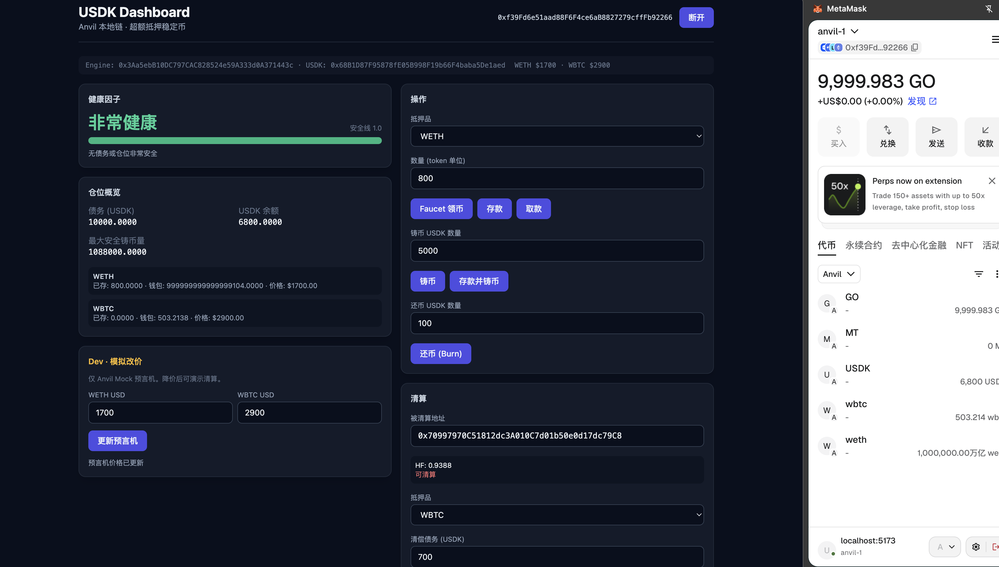
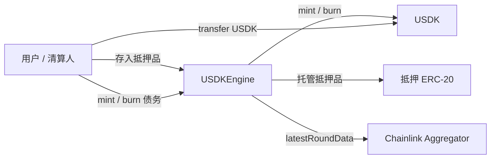

# USDK

**可控 Mint / Burn** 的 ERC-20 稳定币（`USDK`），以及基于超额抵押的 `**USDKEngine`** 借贷与清算逻辑。代币增发权由 `owner` 管控；部署后将 `owner` 交给 Engine，用户仅能通过抵押路径铸造/销毁债务代币。

> 用于学习 Foundry、ERC-20、Chainlink 预言机与 CDP 风控，**非生产级代码**。 

 

## 目录

- [功能概览](#功能概览)
- [架构](#架构)
- [核心公式](#核心公式)
- [项目结构](#项目结构)
- [快速开始](#快速开始)
- [部署](#部署)
- [测试](#测试)

## 功能概览


| 模块                                 | 职责                                                            |
| ---------------------------------- | ------------------------------------------------------------- |
| [USDK](src/USDK.sol)               | 标准 ERC-20；仅 `owner` 可 `mint` / `burn`                         |
| [USDKEngine](src/USDKEngine.sol)   | 多抵押品存取、铸还债务、健康因子、Chainlink 定价、清算                              |
| [IERC20](src/interface/IERC20.sol) | 最小 ERC-20 接口（[EIP-20](https://eips.ethereum.org/EIPS/eip-20)） |


### USDK（稳定币层）

- **权限化供应**：`mint` / `burn` 受 `onlyOwner` 限制
- **标准 ERC-20**：18 位小数，`transfer` / `approve` / `transferFrom`
- **所有权**：`transferOwnership` / `changeOwner` 将铸币权交给 Engine

### USDKEngine（抵押与清算层）

- **多抵押品**：WETH / WBTC + Chainlink 喂价 + 清算阈值（`liquidationThreshold`，精度 `1e4`）
- **存取与铸还**：`deposit` / `redeem`、`mint` / `burn`、`depositAndMint`、`redeemAndBurn`
- **健康因子**：加权抵押 USD 价值 ÷ 债务；`healthFactor < 1e18` 时禁止恶化仓位的操作
- **清算**：仅不健康账户；单次最多清偿债务的 **50%**；清算人获得 **10%** 抵押品奖励
- **安全**：`ReentrancyGuard`；喂价须为正且 **2 小时内**更新

## 架构




**推荐部署顺序**

1. 部署 `USDK("USDK", "USDK", deployer)`
2. 部署 `USDKEngine(usdk, tokens, priceFeeds, thresholds)`
3. `usdk.transferOwnership(address(engine))` — 仅 Engine 可增发/销毁

## 核心公式

**健康因子**（`>= 1e18` 为安全）：

```
healthFactor = Σ(抵押数量 × USD 单价 × liquidationThreshold / 1e4) / 债务（USDK）
```

无债务时 `healthFactor = type(uint256).max`。

**清算奖励**：`bonus = debtToCover × 1000 / 10000`（10%）。

## 项目结构

```
usdk/
├── src/
│   ├── USDK.sol
│   ├── USDKEngine.sol
│   └── interface/IERC20.sol
├── script/
│   ├── DeployUSDK.s.sol
│   ├── WriteDeployment.s.sol # 部署并写入 deployments/
│   └── HelperConfig.s.sol
├── backend/                  # Go 只读 BFF
├── frontend/                 # React + wagmi
├── deployments/
│   └── 31337.json
├── test/
│   ├── unit/
│   │   ├── USDKUnitTest.t.sol        # 8 用例 + fuzz
│   │   └── USDKEngineUnitTest.t.sol  # 38 用例 + fuzz
│   ├── invariant/
│   │   ├── USDKInvariant.t.sol       # Token 层会计不变量
│   │   ├── EngineInvariant.t.sol     # Engine 层会计不变量
│   │   ├── Handler.t.sol             # TokenHandler
│   │   └── EngineHandler.t.sol
│   └── mock/
│       ├── ERC20Mock.sol
│       ├── MockV3Aggregator.sol
│       └── MockAddress.t.sol
├── lib/                      # forge-std、OpenZeppelin、Chainlink（子模块）
├── foundry.toml
└── .github/workflows/test.yml
```

## 技术栈

- [Foundry](https://book.getfoundry.sh/) — 编译、测试、部署
- Solidity **0.8.24**
- [OpenZeppelin](https://github.com/openzeppelin/openzeppelin-contracts) — `ReentrancyGuard`、ERC-20 Mock
- [Chainlink](https://github.com/smartcontractkit/chainlink-evm) — `AggregatorV3Interface`

## 快速开始

### 环境要求

- [Foundry](https://book.getfoundry.sh/getting-started/installation)
- Git（子模块）

### 克隆与依赖

```bash
git clone <your-repo-url> usdk
cd usdk
git submodule update --init --recursive
```

### 编译

```bash
forge build
```

## 部署

[HelperConfig](script/HelperConfig.s.sol) 按 `chainid` 选择环境：


| 网络      | chainId  | 说明                                                       |
| ------- | -------- | -------------------------------------------------------- |
| Anvil   | 31337    | 自动部署 Mock ERC-20 + MockV3Aggregator（ETH $2000、BTC $4000） |
| Sepolia | 11155111 | 使用预设代币与 Chainlink 喂价地址                                   |


```bash
# 本地 Anvil
anvil
forge script script/DeployUSDK.s.sol:DeployUSDK --rpc-url http://127.0.0.1:8545 --broadcast

# Sepolia（需配置 PRIVATE_KEY）
forge script script/DeployUSDK.s.sol:DeployUSDK --rpc-url $SEPOLIA_RPC_URL --broadcast
```

| 方法 | 用途 |
|------|------|
| `run()` | 链上部署：`vm.startBroadcast(config.deployerKey)`，owner = `vm.addr(deployerKey)` |
| `deploy()` | 测试专用：`makeAddr("owner")` + `prank`，不广播 |

Sepolia 需在环境变量配置 `PRIVATE_KEY`；Anvil 默认使用第 0 号测试账户私钥（见 `HelperConfig`）。

## Web UI

Go 只读 BFF + React 前端，连接 Anvil 本地链。写操作通过 MetaMask 签名，读操作走 Go API 聚合。

### 环境

- Node.js 20+
- Go 1.21+
- MetaMask（添加 Anvil：RPC `http://127.0.0.1:8545`，chainId `31337`）

### 启动

```bash
# 1. 本地链
make anvil

# 2. 部署并导出 deployments/31337.json + ABI
make deploy-anvil

# 3. 后端 (8080) + 前端 (5173)
make backend    # 新终端
make frontend   # 新终端
```

### 功能

| 面板 | 说明 |
|------|------|
| Dashboard | 仓位、健康因子、债务、抵押明细 |
| 操作 | Faucet、存款/取款、铸币/还币、存款并铸币 |
| 清算 | 输入被清算地址、预览、执行 liquidate |
| Dev | Mock 预言机改价（演示清算） |

### API（Go BFF）

| 路径 | 说明 |
|------|------|
| `GET /api/config` | 合约地址与抵押品列表 |
| `GET /api/position/{address}` | 聚合仓位 |
| `GET /api/position/{address}/health` | 健康因子 |
| `GET /api/liquidation/preview` | 清算预览 |
| `GET /api/prices` | WETH/WBTC 价格 |

### 联调场景

1. 账户 A：Faucet → 存款 → 铸币 USDK，Dashboard 显示 HF ≥ 1.0
2. Dev 面板将 WETH 价格降至 $1700
3. 账户 B：铸币获得 USDK → 清算账户 A

## 测试

当前 **53** 个测试全部通过（单元 + fuzz + 状态不变量）。

```bash
# 全部
forge test -vvv

# 按模块
forge test --match-path test/unit/USDKUnitTest.t.sol
forge test --match-path test/unit/USDKEngineUnitTest.t.sol
forge test --match-path test/invariant/USDKInvariant.t.sol
forge test --match-path test/invariant/EngineInvariant.t.sol

# 格式化（与 CI 一致）
forge fmt --check

# 覆盖率
forge coverage
```

### 单元测试


| 文件                                                             | 覆盖要点                                                  |
| -------------------------------------------------------------- | ----------------------------------------------------- |
| [USDKUnitTest.t.sol](test/unit/USDKUnitTest.t.sol)             | 初始化、权限、mint/burn、零地址、allowance、`transferFrom`、fuzz 转账 |
| [USDKEngineUnitTest.t.sol](test/unit/USDKEngineUnitTest.t.sol) | 存取/铸还/清算、构造函数与预言机 revert、健康因子、会计一致性、fuzz              |


### 状态不变量（Stateful Fuzz）


| 套件                                                      | 不变量                                                                             |
| ------------------------------------------------------- | ------------------------------------------------------------------------------- |
| [USDKInvariant](test/invariant/USDKInvariant.t.sol)     | `Σ balance == totalSupply`；与 ghost mint/burn 一致                                 |
| [EngineInvariant](test/invariant/EngineInvariant.t.sol) | `Σ 用户债务 == totalSupply`；抵押品托管守恒；USDK 余额之和等于 supply；ghost 账本一致；有债用户 `HF >= 1e18` |


`foundry.toml` 中 `[invariant] fail_on_revert = false`，Handler 允许操作 revert 而不中断模糊序列。

## 主要 API

### USDK


| 函数                                    | 说明                  |
| ------------------------------------- | ------------------- |
| `mint(address to, uint256 value)`     | `onlyOwner` 增发      |
| `burn(uint256 value)`                 | `onlyOwner` 销毁调用者余额 |
| `transferOwnership(address newOwner)` | 转移铸币权               |


### USDKEngine


| 函数                                                      | 说明                      |
| ------------------------------------------------------- | ----------------------- |
| `deposit` / `redeem`                                    | 存入 / 取回抵押品              |
| `mint` / `burn`                                         | 增发 / 偿还 USDK 债务         |
| `depositAndMint` / `redeemAndBurn`                      | 组合操作                    |
| `liquidate(account, collateralToken, debtToCover)`      | 清算不健康账户                 |
| `getHealthFactor` / `getUserDebt` / `getUserCollateral` | 只读查询                    |
| `getTotalDebt`                                          | 等于 `USDK.totalSupply()` |


## 设计说明与局限

- **中心化铸币权**：`USDK.owner` 拥有绝对增发权，适合模拟机构稳定币；生产环境需多签/治理
- **Engine 为唯一 minter**：用户债务代币仅能通过 Engine 产生与销毁
- **预言机依赖**：2 小时价格新鲜度检查，未覆盖完整操纵防御
- **清算约束**：深度 underwater 时单次清算可能因 `HealthFactorMustBeRaised` 失败
- **练习范围**：无暂停、冻结、升级代理、访问控制角色等企业级能力

